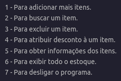

# PROGRAMA PARA ESTOQUE DE LOJAS

## Python

Programinha desenvolvido por mim, em função Curso de Python da Fiap

O programa serve para cadastrar itens ao estoque, com suas especificações, verifica-los em estoque, exluir, atribuir desconto, e mais algumas funções. 

 

## Funções do programa:

 

## Saída

 
    
    
    

   

## Saída completa
 

Adicionar itens? Sim

Item: Pá  
Valor: 31.90  
Número Serial: 123  
Departamento: Escavação  

Adicionar mais itens? S

Item: Vassoura  
Valor: 18.76  
Número Serial: 345  
Departamento: Limpeza  

Adicionar mais itens? sim

Item: Picareta  
Valor: 37.90  
Número Serial: 123  
Departamento: Mineração  

Adicionar mais itens? s

Item: Rodo   
Valor: 19.76   
Número Serial: 354   
Departamento: Limpeza  

Adicionar mais itens? n

Itens adicionados:

Nome.........:  Pá  
Valor........:  31.9  
Serial.......:  123  
Departamento.:  Escavação  

Nome.........:  Vassoura  
Valor........:  18.76  
Serial.......:  345  
Departamento.:  Limpeza  

Nome.........:  Picareta  
Valor........:  37.9  
Serial.......:  123  
Departamento.:  Mineração  

Nome.........:  Rodo  
Valor........:  19.76  
Serial.......:  354  
Departamento.:  Limpeza  

1 - Para adicionar mais itens.         
2 - Para buscar um item.         
3 - Para excluir um item.          
4 - Para atribuir desconto à um item.         
5 - Para obter informações dos itens.         
6 - Para exibir todo o estoque.         
7 - Para desligar o programa.

O que deseja fazer? 3

Digite o serial ou nome do(s) equipamento(s) que deseja excluir: vassoura

Item Vassoura - Exluido!

1 - Para adicionar mais itens.        
2 - Para buscar um item.         
3 - Para excluir um item.          
4 - Para atribuir desconto à um item.         
5 - Para obter informações dos itens.         
6 - Para exibir todo o estoque.         
7 - Para desligar o programa.

O que deseja fazer? 6

Nome.........:  Pá   
Valor........:  31.9  
Serial.......:  123  
Departamento.:  Escavação  

Nome.........:  Picareta  
Valor........:  37.9  
Serial.......:  123  
Departamento.:  Mineração  

Nome.........:  Rodo  
Valor........:  19.76  
Serial.......:  354  
Departamento.:  Limpeza  

1 - Para adicionar mais itens.        
2 - Para buscar um item.         
3 - Para excluir um item.          
4 - Para atribuir desconto à um item.         
5 - Para obter informações dos itens.         
6 - Para exibir todo o estoque.         
7 - Para desligar o programa.

O que deseja fazer? 1

Item: Vassoura
Valor: 23.98
Número Serial: 346
Departamento: Limpeza

Adicionar mais itens? n

1 - Para adicionar mais itens.        
2 - Para buscar um item.         
3 - Para excluir um item.          
4 - Para atribuir desconto à um item.         
5 - Para obter informações dos itens.         
6 - Para exibir todo o estoque.         
7 - Para desligar o programa.

O que deseja fazer? 6

Nome.........:  Pá  
Valor........:  31.9  
Serial.......:  123   
Departamento.:  Escavação  

Nome.........:  Picareta  
Valor........:  37.9  
Serial.......:  123  
Departamento.:  Mineração  

Nome.........:  Rodo  
Valor........:  19.76  
Serial.......:  354  
Departamento.:  Limpeza  

Nome.........:  Vassoura  
Valor........:  23.98  
Serial.......:  346  
Departamento.:  Limpeza  

1 - Para adicionar mais itens.        
2 - Para buscar um item.         
3 - Para excluir um item.          
4 - Para atribuir desconto à um item.         
5 - Para obter informações dos itens.         
6 - Para exibir todo o estoque.         
7 - Para desligar o programa.

O que deseja fazer? 2

Digite o nome, serial ou departamento do(s) equipamento(s) que deseja buscar: vassoura

Nome.........:  Vassoura  
Valor........:  23.98  
Serial.......:  346  
Departamento.:  Limpeza  

1 - Para adicionar mais itens.        
2 - Para buscar um item.         
3 - Para excluir um item.          
4 - Para atribuir desconto à um item.         
5 - Para obter informações dos itens.         
6 - Para exibir todo o estoque.         
7 - Para desligar o programa.

O que deseja fazer? 2

Digite o nome, serial ou departamento do(s) equipamento(s) que deseja buscar: 123

Nome.........:  Pá  
Valor........:  31.9  
Serial.......:  123  
Departamento.:  Escavação  

Nome.........:  Picareta  
Valor........:  37.9  
Serial.......:  123  
Departamento.:  Mineração  

1 - Para adicionar mais itens.        
2 - Para buscar um item.         
3 - Para excluir um item.          
4 - Para atribuir desconto à um item.         
5 - Para obter informações dos itens.         
6 - Para exibir todo o estoque.         
7 - Para desligar o programa.

O que deseja fazer? 2

Digite o nome, serial ou departamento do(s) equipamento(s) que deseja buscar: limpeza

Nome.........:  Rodo  
Valor........:  19.76  
Serial.......:  354  
Departamento.:  Limpeza  

Nome.........:  Vassoura  
Valor........:  23.98  
Serial.......:  346  
Departamento.:  Limpeza  

1 - Para adicionar mais itens.        
2 - Para buscar um item.         
3 - Para excluir um item.          
4 - Para atribuir desconto à um item.         
5 - Para obter informações dos itens.         
6 - Para exibir todo o estoque.         
7 - Para desligar o programa.

O que deseja fazer? 5

O equipamento mais caro custa: R$ 37.9
O equipamento mais barato custa: R$ 19.76
A soma do valor de todo o estoque: R$ 113.54
A quantidade de itens em estoque:  4

1 - Para adicionar mais itens.        
2 - Para buscar um item.         
3 - Para excluir um item.          
4 - Para atribuir desconto à um item.         
5 - Para obter informações dos itens.         
6 - Para exibir todo o estoque.         
7 - Para desligar o programa.

O que deseja fazer? 4

Digite o nome do item que deseja atribuir desconto: picareta

Opções: 5% - 10% - 15% - 20%
Quanto deseja descontar? 15

Nome.........:  Picareta  
Valor antigo:  37.9   
Novo valor..:  32.21  

1 - Para adicionar mais itens.        
2 - Para buscar um item.         
3 - Para excluir um item.          
4 - Para atribuir desconto à um item.         
5 - Para obter informações dos itens.         
6 - Para exibir todo o estoque.         
7 - Para desligar o programa.

O que deseja fazer? 5

O equipamento mais caro custa: R$ 32.21
O equipamento mais barato custa: R$ 19.76
A soma do valor de todo o estoque: R$ 107.85
A quantidade de itens em estoque:  4

1 - Para adicionar mais itens.        
2 - Para buscar um item.         
3 - Para excluir um item.          
4 - Para atribuir desconto à um item.         
5 - Para obter informações dos itens.         
6 - Para exibir todo o estoque.         
7 - Para desligar o programa.

O que deseja fazer? 6

Nome.........:  Pá  
Valor........:  31.9  
Serial.......:  123  
Departamento.:  Escavação  

Nome.........:  Rodo  
Valor........:  19.76  
Serial.......:  354  
Departamento.:  Limpeza  

Nome.........:  Vassoura  
Valor........:  23.98  
Serial.......:  346  
Departamento.:  Limpeza  

Nome.........:  Picareta  
Valor........:  32.21  
Serial.......:  123  
Departamento.:  Mineração  

1 - Para adicionar mais itens.        
2 - Para buscar um item.         
3 - Para excluir um item.          
4 - Para atribuir desconto à um item.         
5 - Para obter informações dos itens.         
6 - Para exibir todo o estoque.         
7 - Para desligar o programa.

O que deseja fazer? 7

Programa desligado!

