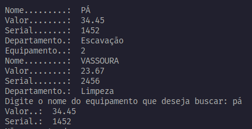
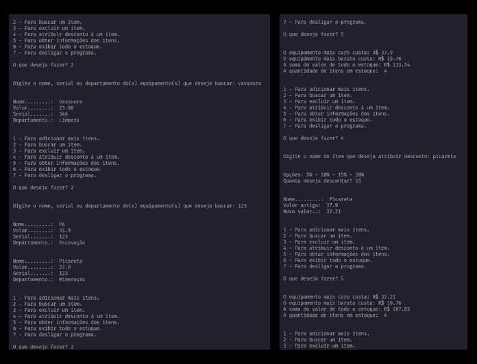

# PROGRAMA PARA ESTOQUE DE LOJAS

## Python

Programinha desenvolvido nas aulas do Curso de Python da Fiap

Cadastre os equipamentos e as suas especificações, é possível consultar e exluir itens quando quiser!

 

## Saída:
 

Buscando item

  

Excluindo item

