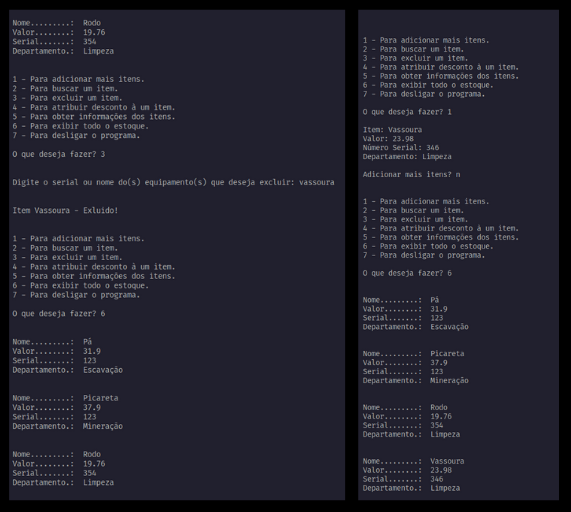

# PROGRAMA PARA BANCO DE DADOS E CONSULTA DE ITENS EM ESTOQUE DE LOJA

## Python

Programinha desenvolvido nas aulas do Curso de Python da Fiap

Cadastre os equipamentos e as suas especificações e depois consulte quando quiser!

 

Saída:

 

